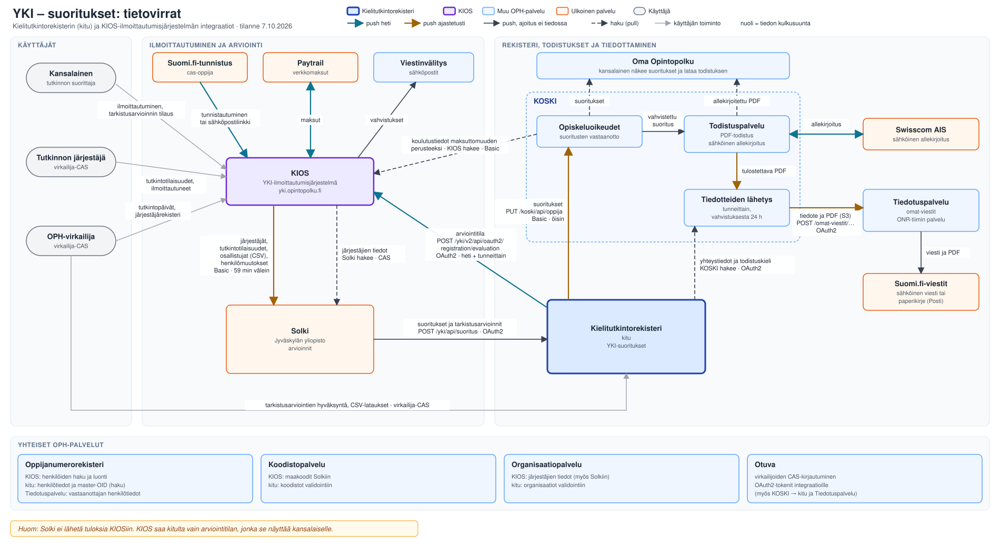
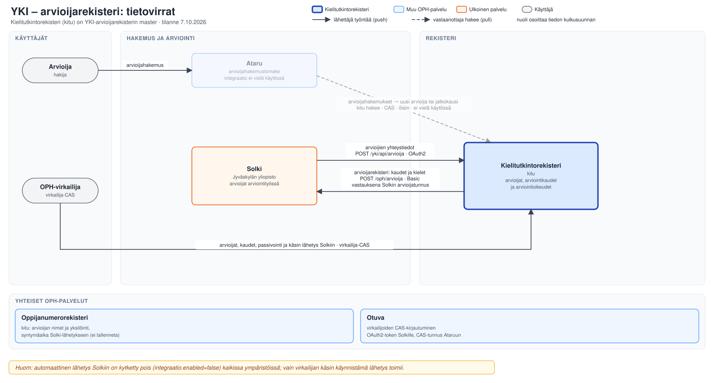
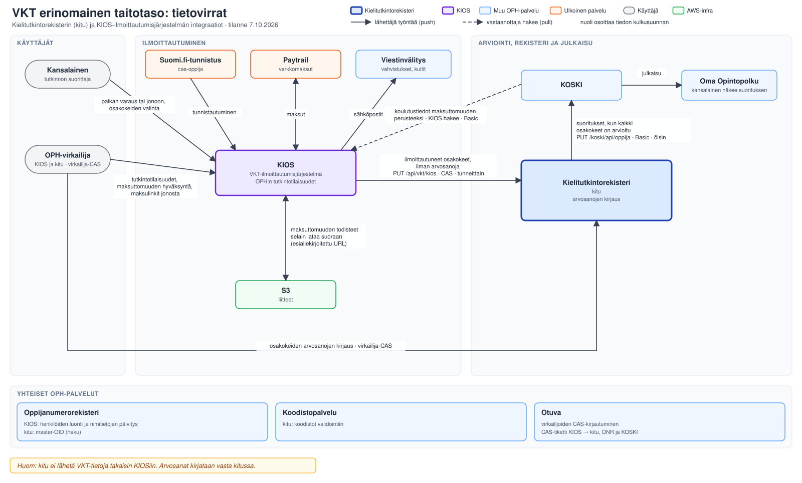
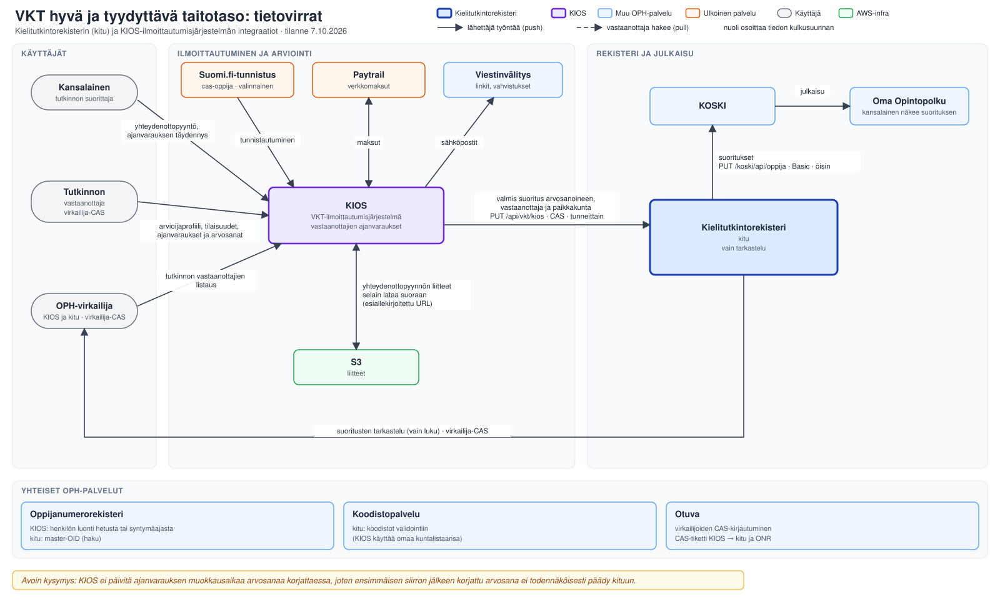
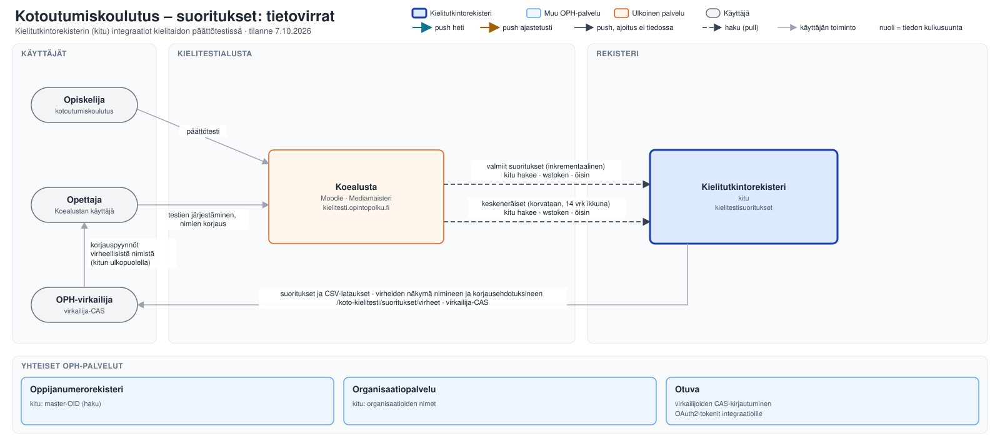
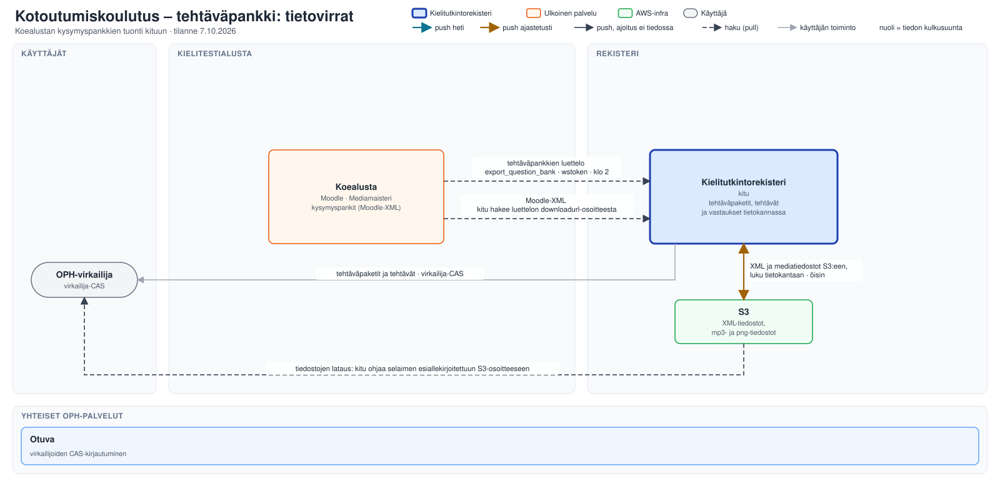

# Integraatiot

Kielitutkintorekisteri integroituu OPH:n ja kolmansien osapuolten järjestelmiin. Tämä sivu kuvaa
kullekin integraatiolle paketin, suunnan, asiakaskerroksen ja virhemallin.

## Kaaviot

Tietovirrat tutkinnoittain, mukaan lukien KIOS-ilmoittautumisjärjestelmän
([kieli-ja-kaantajatutkinnot](https://github.com/Opetushallitus/kieli-ja-kaantajatutkinnot) ja
vanha YKI-taustapalvelu [yki](https://github.com/Opetushallitus/yki)) omat integraatiot. Kaaviot
ovat muokattavia SVG-tiedostoja hakemistossa `kaaviot/`.

### YKI — suoritukset



Solki ei lähetä tuloksia KIOSiin. KIOS saa kitulta vain suorituksen arviointitilan, jonka se
näyttää kansalaiselle tämän omalla sivulla.

### YKI — arvioijarekisteri



### VKT — erinomainen taitotaso



### VKT — hyvä ja tyydyttävä taitotaso



**Avoin kysymys:** KIOS lähettää ajanvarauksen uudelleen vain, jos sen muokkausaika on myöhäisempi
kuin edellinen lähetys. Arvosanan korjaaminen ei päivitä ajanvarauksen muokkausaikaa, joten
ensimmäisen siirron jälkeen korjattu arvosana ei todennäköisesti koskaan päädy kituun
(`SyncRegisterEnrollments` repossa kieli-ja-kaantajatutkinnot).

### Kotoutumiskoulutus — suoritukset



Kotoutumiskoulutuksen tiedot eivät mene kitusta KOSKI-järjestelmään eivätkä KIOSiin, eivätkä KIOS
ja Solki liity kotoutumiskoulutukseen lainkaan.

### Kotoutumiskoulutus — tehtäväpankki



## KOSKI — suoritusten siirto

**Paketti:** `koski/` · **Suunta:** lähetys

Onnistuneet YKI- ja VKT-suoritukset lähetetään KOSKI-palveluun, joka julkaisee ne Oma
Opintopolussa.

- `KoskiService.sendYkiSuorituksetToKoski()` ja `sendVktSuorituksetToKoski()` palauttavat
  `Either<KoskiTechnicalException, KoskiTransferReport>`. Tekniset virheet palautetaan vasempana;
  tietosisällölliset virheet kerätään raporttiin ja merkitään uudelleen lähetettäviksi.
- `KoskiException`-hierarkiassa `KoskiTechnicalException` on uudelleenyritettävä.
- Eräajot `Lähetä YKI-suoritukset KOSKI-palveluun` ja VKT-vastine, ks. [Eräajot](../db-scheduler).

### YKI-todistukset ja tiedotteet KOSKI-järjestelmässä

KOSKI-järjestelmä tekee YKI-suorituksista todistukset ja tiedottaa niistä kansalaiselle. Tämä ei
kuulu kituun, mutta siihen kuuluu kitun yhteystietorajapinnan ainoa kutsuja (lähde: repo
[koski](https://github.com/Opetushallitus/koski), `src/main/scala/fi/oph/koski/todistus/`).

- **Todistuspalvelu** (osa KOSKI-sovellusta) luo vahvistetusta suorituksesta PDF-todistuksen ja
  allekirjoittaa sen sähköisesti Swisscom AIS -palvelulla. Kansalainen lataa allekirjoitetun
  todistuksen Oma Opintopolusta.
- **Tiedotteiden lähetys** (osa KOSKI-sovellusta, tunneittain, kun vahvistuksesta on kulunut 24 h)
  hakee kitusta suorittajan yhteystiedot ja todistuskielen (`GET /yhteystiedot/api/opiskeluoikeus/…`,
  OAuth2). Se tekee tulostettavan PDF:n ja lähettää tiedotteen **Tiedotuspalveluun**
  (ONR-tiimin erillinen palvelu, repo
  [tiedotuspalvelu](https://github.com/Opetushallitus/tiedotuspalvelu)). Tiedotuspalvelu lähettää
  sen Suomi.fi-viestien kautta joko sähköisenä viestinä tai Postin paperikirjeenä, jossa on kitun
  postiosoite.

## KIOS — ilmoittautumisjärjestelmä

**Paketit:** `ilmoittautumisjarjestelma/` (YKI), `vkt/` (VKT) · **Suunta:** lähetys (YKI-arviointitilat),
vastaanotto (VKT)

YKI-suoritusten arviointitilat ilmoitetaan KIOS:lle heti suoritustiedon päivittyessä
(`POST /yki/v2/api/oauth2/registration/evaluation`, OAuth2); eräajo
`Lähetä YKI-arviointitilat KIOS-palveluun` varmistaa perille menon katkosten jälkeen. KIOS näyttää
tilan kansalaiselle tämän omalla sivulla.

VKT-tiedot KIOS **lähettää** kitulle (`PUT /api/vkt/kios`) tunnin välein ajettavalla eräajolla
(`SyncRegisterEnrollments` KIOSissa). Erinomaisesta taitotasosta tulee ilmoittautuminen ilman
arvosanoja tutkintopäivän jälkeen, ja arvosanat kirjataan kitussa; hyvästä ja tyydyttävästä tulee
valmis suoritus, jonka arvosanat tutkinnon vastaanottaja on kirjannut KIOSiin. KIOS autentikoituu
**CAS-palvelutiketillä**, ei OAuth2-tokenilla — tästä syystä reitti
`/api/vkt/kios/j_spring_cas_security_check` on olemassa. Kitu ei lähetä VKT-tietoja takaisin KIOSiin.

- `IlmoittautumisjarjestelmaClientImpl.post(...)` → `Either<IlmoittautumisjarjestelmaException, T>`.
- Virhetyypit: `BadRequest`, `UnexpectedError`, `MalformedResponse`, `NullResponse`.

## Oppijanumerorekisteri

**Paketti:** `oppijanumero/` · **Suunta:** haku

Henkilötietojen ja oppijanumeroiden nouto.

- `OppijanumerorekisteriClient.getUser(...)` → `Either<OppijanumeroException, Oppija>`.
- Virhetyypit: `OppijaNotFoundException`, `BadRequest`, `UnexpectedError`, `MalformedResponse`,
  `NullResponse`. `HasResponse` merkitsee ne, joilla on raaka HTTP-vastaus liitteenä.

## Organisaatiopalvelu

**Paketti:** `organisaatiot/` · **Suunta:** haku

Oppilaitosten OID:t ja niiden hierarkia validoinnin tueksi.
`OrganisaatiopalveluClient.get(...)` → `Either<OrganisaatiopalveluException, T>`; virhetyypit
vastaavat oppijanumeropuolen mallia.

## Koodisto

**Paketti:** `koodisto/` · **Suunta:** haku

OPH:n keskitetty koodistopalvelu, mm. kielikoodien ja luokitusten validointiin.

## Koealusta (kotoutumiskoulutus)

**Paketti:** `kotoutumiskoulutus/koealusta/` · **Suunta:** haku + tiedoston tuonti

Moodle-pohjainen kielitestialusta, josta haetaan suoritustietoja ja Moodle-XML-tehtäväpaketteja.

- Valmiit suoritukset haetaan inkrementaalisesti (`from`-vesileima db-schedulerin tilassa),
  keskeneräiset korvataan joka ajolla kokonaan ja rajataan ilmoittautumisajan perusteella
  (`enrolledfrom`, ks. [Eräajot](../db-scheduler)).
- `KoealustaSuoritusValidator` validoi suoritusten datan →
  `Either<KoealustaMappingError.*Failure, …>`.
- `tehtavapankki/TehtavapankkiIngestService` lataa XML:t S3:sta, parsii ne ja tallentaa yleiseen
  tehtäväpankki-skeemaan.

## Solki — YKI-tietojen lähde ja arvioijarekisterin vastaanottaja

**Paketit:** `yki/`, `yki/arvioijat/solki/` · **Suunta:** kaksisuuntainen

Yleiset kielitutkinnot tulevat Jyväskylän yliopiston Solki-järjestelmästä. Arvioijarekisterin
master on kitu.

### Arvioijarekisterin lähetys (kitu → Solki)

Jokainen kitussa tehty tallennus lähetetään Solkille:

```
POST {kitu.yki.baseUrl}arvioija
Authorization:   Basic (kitu.yki.username/password, samat tunnukset kuin suoritushaussa)
Idempotency-Key: {arvioijaOid}:{versio}
```

Runko on `SolkiArvioijaRequest`; henkilötunnusta ei lähetetä. **`tila`-kenttää ei lähetetä**: tila
lasketaan kauden päivistä (`Rekisterointitila`), joten lähetetty arvo vanhenisi vastaanottajan
kopiossa kauden umpeutuessa. Vastaanottaja johtaa tilan `kaudenAlkupaiva`n ja
`kaudenPaattymispaiva`n välistä, **päättymispäivä mukaan lukien**.

`syntymapaiva` haetaan ONR:stä lähetyshetkellä (`OppijanumeroService.getHenkiloByMasterOid`); kitu
ei säilytä sitä. Kolme tapausta:

| ONR                                                | Kitu tekee                                                                   |
| -------------------------------------------------- | ---------------------------------------------------------------------------- |
| vastaa, syntymäaika on                             | lähettää kentän muodossa `yyyy-MM-dd`                                        |
| vastaa, syntymäaikaa ei ole (yksilöimätön henkilö) | jättää kentän pois (`@JsonInclude(NON_NULL)`) ja merkitsee rivin lähetetyksi |
| ei vastaa                                          | **ei lähetä lainkaan**: `merkitseLahetysvirhe`, ja rivi jää jonoon           |

Viimeinen tapaus epäonnistuu tarkoituksella kiinni: vajaana lähtenyt rivi merkittäisiin
lähetetyksi, jolloin ONR-katko jättäisi pysyvän aukon Solkin kopioon.

**Lähetysjono** elää `yki_arvioija`-taulun sarakkeissa `solkiin_lahetetty`, `solki_lahetysvirhe`,
`solki_lahetysyritykset` ja `solki_viimeisin_lahetysyritys`. Rivi on jonossa, kun
`solkiin_lahetetty IS NULL OR solkiin_lahetetty < muokattu`. Solkista sisään tullut push leimataan
heti lähetetyksi, jottei Solkin oma data kaiu takaisin sille.

**Uudelleenyritykset** (`SolkiArvioijaScheduledTasks`): yksi synkroninen yritys tallennuksen
jälkeen, sitten `FIXED_DELAY|900s` riveille `solki_lahetysyritykset < 3` ja `DAILY|02:15` kaikille
lähettämättömille.

**Vastaus:** Solki palauttaa arvioijatunnuksen, joka tallennetaan sarakkeeseen
`yki_arvioija.solki_tunnus` ja näytetään arvioijan tietosivulla. Päivitys on
`COALESCE(?, solki_tunnus)`, joten tyhjä vastaus ei pyyhi aiemmin saatua tunnusta.

**Virheilmoitus ei sisällä pyyntörunkoa** (`SolkiArvioijaException.debugString()`): osoite,
sähköposti ja syntymäaika ovat henkilötietoa, ja virhe päätyy sekä lokiin että käyttöliittymässä
näkyvään virhesarakkeeseen. Vastausrunko otetaan mukaan, mutta **katkaistaan 500 merkkiin**.

Virkailija näkee tilan arvioijan tietosivun **Integraatiot**-kortissa ja voi käynnistää lähetyksen
uudelleen. Listanäkymässä on suodatin `vainSolkiVirheet` ja etusivulla laskuri.

### Yhteystietojen päivitys (Solki → kitu)

Solki lähettää yhteystietomuutokset rajapintaan `POST /yki/api/arvioija`. Rekisterimerkintää se ei
kirjoita: nimet tulevat ONR:stä ja kaudet kitusta.

### Kytkin `kitu.yki.arvioijarekisteri.integraatio.enabled`

Ohjaa molempia suuntia sekä yöllistä `paivitaArvioijaProjektiot`-ajoa (`DAILY|03:15`), joka pitää
`yki_arviointioikeus`-projektion ajan tasalla kausimasterin kanssa.

- **Päällä:** lähetys on käytössä ja sisääntulo kavennetaan yhteystietoihin.
- **Pois:** lähetettävät rivit jäävät jonoon ja lähtevät takautuvasti kytkimen avautuessa, ja
  Solkin koko payload otetaan vastaan ja tallennetaan.
- Kytkin on erillinen osoitteesta: `kitu.yki.baseUrl` on asetettu joka ympäristössä (myös local ja
  e2e dev-stubiin), joten sen olemassaolo ei kerro, saako lähettää.
- **Virkailijan käsin käynnistämä lähetys ei katso kytkintä.** Tietosivun "Lähetä uudelleen
  Solkiin" kutsuu `SolkiArvioijaService.lahetaArvioijaKasin`ia; yksittäinen lähetys on se tapa,
  jolla integraatiota kokeillaan ennen automaattisen liikenteen avaamista. Siksi
  `SolkiArvioijaClientImpl` ja `SolkiArvioijaServiceImpl` ovat ehdottomia beaneja ja kytkin luetaan
  vasta palvelun sisällä. Painike itsessään on **muokkauskytkimen** takana.

## Ataru — YKI-arvioijahakemukset

**Paketit:** `ataru/` (asiakas), `yki/arvioijat/hakemus/` (tuonti) · **Suunta:** haku

Arvioijahakemuslomakkeen hakemuksista luodaan YKI-arvioijamerkinnät (uusi arvioija tai
jatkokausi, joka alkaa voimassa olevan kauden päättymistä seuraavana päivänä). Lomakkeen
vuoden raja alkupäivälle ei koske tällaista jatkokautta (`TallennaArvioija.automaattinenJatkokausi`).

- Lomakkeen avain ja kenttien id:t ovat `ArvioijahakemusLomake`ssa ja hyväksymisehdot
  `ArvioijahakemusKriteeri`ssä — kovakoodattuina, ei asetuksina.
- `AtaruClient.haeHakemusavaimet(...)` → `POST /lomake-editori/api/applications/list`
  (`form-key`, `option-answers`, sivukursori `sort.offset`). Tämä on atarun virkailija-UI:n reitti,
  ei sovittu ulkoinen rajapinta.
- `AtaruClient.haeHakemukset(...)` → `POST /lomake-editori/api/external/siirto?salliYksiloimattomat=true`
  (runkona hakemusavaimet, 200 kerrallaan). Ilman parametria yksikin yksilöimätön hakija kaataa
  koko kutsun 409:llä.
- Virhetyypit: `BadRequest`, `UnexpectedError`, `MalformedResponse`, `NullResponse`, `Unauthorized`.
- **Autentikointi on CAS, ei OAuth2**: ataru ei hyväksy Bearer-tokenia. `security/cas/client/`
  kirjautuu palvelukäyttäjänä (`/cas/v1/tickets` → ST palvelulle `/lomake-editori/auth/cas` →
  eväste `ring-session`) ja kirjautuu uudelleen 401:n jälkeen.
- Käsittelytilat (`yki_arvioijahakemus.tila`): `KASITELTY`, `HYLATTY`, `EI_TAYTA_EHTOJA`,
  `ODOTTAA_YKSILOINTIA` (haetaan joka ajolla uudelleen) ja `KASITTELYSSA` (ajo keskeytyi arvioijan
  tallennuksen jälkeen; tarkistettava käsin, ei käsitellä uudelleen).
- `kitu.ataru.service.url` tyhjä = integraatio pois päältä (ei asiakasta, palvelua eikä eräajoa).

### Vaaditut käyttöoikeudet

| Oikeus                                                                                    | Missä                                    | Huom                                                                                                                                                                             |
| ----------------------------------------------------------------------------------------- | ---------------------------------------- | -------------------------------------------------------------------------------------------------------------------------------------------------------------------------------- |
| `ATARU_HAKEMUS` READ (`APP_ATARU_HAKEMUS_READ_<org>`) palvelukäyttäjälle `koto-rekisteri` | lomakkeen omistava OPH:n alaorganisaatio | Ilman oikeutta ataru **pudottaa hakemukset hiljaa** — tyhjä vastaus, ei virhettä. Oikeutta ei myönnetä OPH:n juuriorganisaatioon, koska se tekisi käyttäjästä ataru-superuserin. |
| CAS-kirjautuminen palvelukäyttäjälle `koto-rekisteri`                                     | Otuva CAS REST (`/cas/v1/tickets`)       | Käyttää `kitu.palvelukayttaja.username/password`-arvoja (`palvelukayttaja-password`); uutta tunnusta tai salaisuutta ei tarvita.                                                 |
| ONR                                                                                       | —                                        | Nykyiset oikeudet riittävät (samat kutsut kuin arvioijalomakkeella).                                                                                                             |
| Kitussa `YKI_ARVIOIJAREKISTERI`                                                           | `/yki/arvioijat/hakemukset`              | Hylättyjen hakemusten tarkistusnäkymä.                                                                                                                                           |

`yki_arvioijahakemus` on pelkkä kirjanpito käsitellyistä hakemuksista, eikä sillä ole
säilytysaikaa: rivin poistaminen saisi seuraavan ajon luomaan arvioijan uudelleen samasta hakemuksesta.

`ATARU_EDITORI`-, `VALINTA_*`- tai CRUD-oikeuksia ei tarvita, koska kitu vain lukee. Siirto
palauttaa hetun, mutta kitu ei tallenna sitä, eikä tauluun `yki_arvioijahakemus` kirjoiteta vastauksia.

## CAS + OAuth2 — virkailija-autentikointi

**Paketti:** `security/` (`security/cas/`, `security/oauth2/`) · **Suunta:** haku

Sovellus käyttää OPH:n keskitettyä Otuva-palvelua.

## Auditlokit

**Paketti:** `auditlogs/`

OPH:n auditlokitoteutus ECS-formaatissa. Lokien siirto S3:een hoidetaan infrassa
(`koski-audit-logs-integration-stack`); palvelun ylläpitää KOSKI-tiimi.
